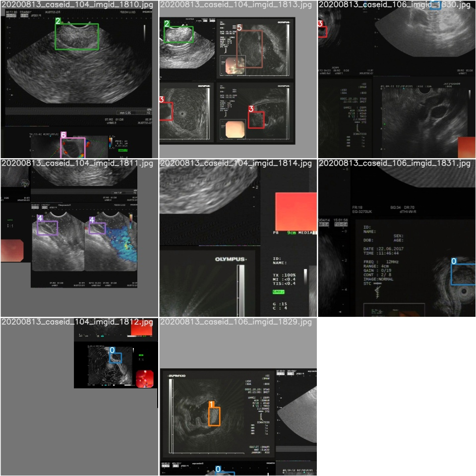
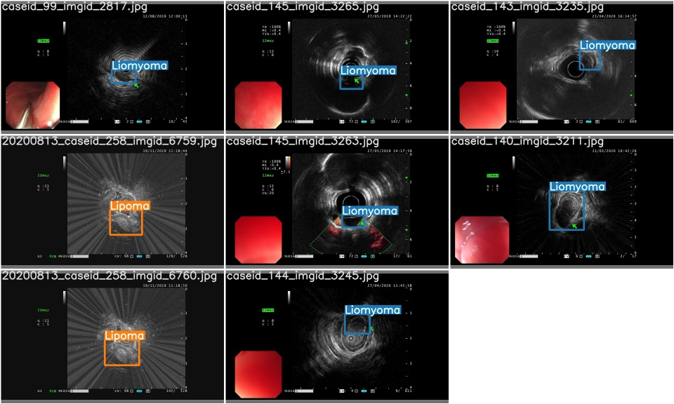
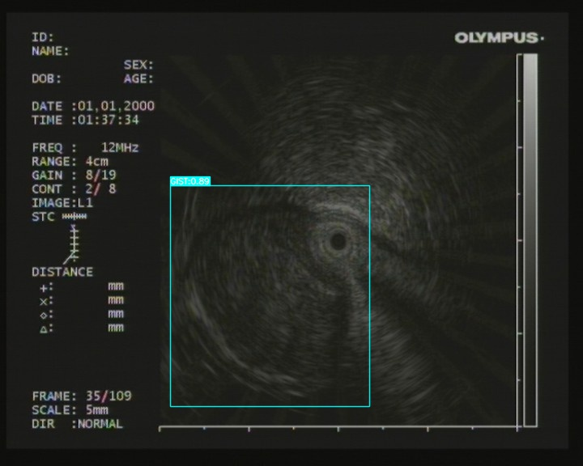
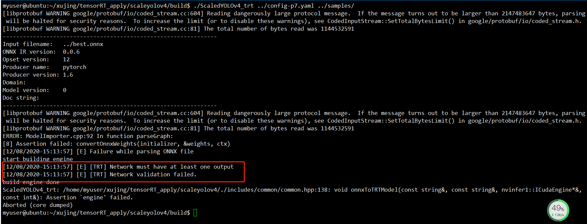

## [Scaled YOLOv4](https://github.com/WongKinYiu/ScaledYOLOv4) 训练自己的数据集

> 感谢 <https://github.com/WongKinYiu/ScaledYOLOv4> 大佬的开源！！！

**DataXujing**

我们以训练YOLOv4-P7为例，介绍如何基于Scaled YOLOv4训练自己的数据集

### 0.环境配置

```
python3.7 cuda 10.2
pytorch==1.6.0
torchvision==0.7.0

# mish-cuda
# 使用预训练的模型
git clone https://github.com/thomasbrandon/mish-cuda mc
cd mc

# change all of name which is mish_cuda to mish_mish and build.
# 1. mc/src/mish_cuda -> mc/src/mish_mish
# 2. mc/csrc/mish_cuda.cpp -> mc/csrc/mish_mish.cpp
# 3. in mc/setup.py
#   3.1 line 5 -> 'csrc/mish_mish.cpp'
#   3.2 line 11 -> name='mish_mish'
#   3.3 line 20 -> 'mish_mish._C'

python setup.py build
# rename mc/build/lib.xxx folder to mc/build/lib

# modify import in models/common.py
# line 7 -> from mc.build.lib.mish_mish import MishCuda as Mish
# 不使用预训练的模型，可以
git clone https://github.com/thomasbrandon/mish-cuda
cd mish-cuda
python setup.py build install

```

遗憾的是我再CUDA9.0下成功的安装了mish-cuda,但是在CUDA9.2,CUDA10.0和CUDA10.2下均未成功安装mish-cuda,最后我在common.py中基于pytorch实现了Mish,实现方式如下：

```python
 no pretrain
# from mish_cuda import MishCuda as Mish
# pretrain
#from mc.build.lib.mish_mish import MishCuda as Mish

#------------------by xujing------------
# 实在装不上mish-cuda,用pytorch自己实现
class Mish(nn.Module):
    def __init__(self):
        super().__init__()
        # print("Mish activation loaded...")
    def forward(self,x):
        x = x * (torch.tanh(F.softplus(x)))
        return x
# ---------------------------------------------


```

### 1.数据集准备

数据集的准备请参考：<https://github.com/DataXujing/YOLO-v5>,其结构如下图所示：

```
eus         # 数据集名称
├─images
│  ├─train  # 训练图片存放地址
│  └─val    # 验证图片存放地址
└─labels
    ├─train # train txt标注文件存放地址
    └─val   # val txt标注文件存放地址

```

### 2.模型修改

+ 修改增加`./data/eus.yaml`

```
# train and val datasets (image directory or *.txt file with image paths)
train: ./eus/images/train  # <-----------训练集存放地址
val: ./eus/images/val  # <----------开发集存放地址
test: ./eus/images/val  # <--------测试集存放地址

# number of classes
nc: 7     # <----------类别数量

# class names
names: ["Liomyoma", "Lipoma", "Pancreatic Rest", "GIST", "Cyst",  "NET", "Cancer"]   # <----列别列表


```

+ 修改增加`./models/eus/yolov4-p7.yaml`

```
# parameters
nc: 7  # <----------------------------------number of classes
depth_multiple: 1.0  # expand model depth
width_multiple: 1.25  # expand layer channels

# anchors
anchors:
  - [13,17,  22,25,  27,66,  55,41]  # P3/8
  - [57,88,  112,69,  69,177,  136,138]  # P4/16
  - [136,138,  287,114,  134,275,  268,248]  # P5/32
  - [268,248,  232,504,  445,416,  640,640]  # P6/64
  - [812,393,  477,808,  1070,908,  1408,1408]  # P7/128

# csp-p7 backbone
backbone:
  # [from, number, module, args]
  [[-1, 1, Conv, [32, 3, 1]],  # 0
   [-1, 1, Conv, [64, 3, 2]],  # 1-P1/2
   [-1, 1, BottleneckCSP, [64]],
   [-1, 1, Conv, [128, 3, 2]],  # 3-P2/4
   [-1, 3, BottleneckCSP, [128]],
   [-1, 1, Conv, [256, 3, 2]],  # 5-P3/8
   [-1, 15, BottleneckCSP, [256]],
   [-1, 1, Conv, [512, 3, 2]],  # 7-P4/16
   [-1, 15, BottleneckCSP, [512]],
   [-1, 1, Conv, [1024, 3, 2]], # 9-P5/32
   [-1, 7, BottleneckCSP, [1024]],
   [-1, 1, Conv, [1024, 3, 2]], # 11-P6/64
   [-1, 7, BottleneckCSP, [1024]],
   [-1, 1, Conv, [1024, 3, 2]], # 13-P7/128
   [-1, 7, BottleneckCSP, [1024]],  # 14
  ]

# yolov4-p7 head
# na = len(anchors[0])
head:
  [[-1, 1, SPPCSP, [512]], # 15
   [-1, 1, Conv, [512, 1, 1]],
   [-1, 1, nn.Upsample, [None, 2, 'nearest']],
   [-6, 1, Conv, [512, 1, 1]], # route backbone P6
   [[-1, -2], 1, Concat, [1]],
   [-1, 3, BottleneckCSP2, [512]], # 20 
   [-1, 1, Conv, [512, 1, 1]],
   [-1, 1, nn.Upsample, [None, 2, 'nearest']],
   [-13, 1, Conv, [512, 1, 1]], # route backbone P5
   [[-1, -2], 1, Concat, [1]],
   [-1, 3, BottleneckCSP2, [512]], # 25
   [-1, 1, Conv, [256, 1, 1]],
   [-1, 1, nn.Upsample, [None, 2, 'nearest']],
   [-20, 1, Conv, [256, 1, 1]], # route backbone P4
   [[-1, -2], 1, Concat, [1]],
   [-1, 3, BottleneckCSP2, [256]], # 30
   [-1, 1, Conv, [128, 1, 1]],
   [-1, 1, nn.Upsample, [None, 2, 'nearest']],
   [-27, 1, Conv, [128, 1, 1]], # route backbone P3
   [[-1, -2], 1, Concat, [1]],
   [-1, 3, BottleneckCSP2, [128]], # 35
   [-1, 1, Conv, [256, 3, 1]],
   [-2, 1, Conv, [256, 3, 2]],
   [[-1, 30], 1, Concat, [1]],  # cat
   [-1, 3, BottleneckCSP2, [256]], # 39
   [-1, 1, Conv, [512, 3, 1]],
   [-2, 1, Conv, [512, 3, 2]],
   [[-1, 25], 1, Concat, [1]],  # cat
   [-1, 3, BottleneckCSP2, [512]], # 43
   [-1, 1, Conv, [1024, 3, 1]],
   [-2, 1, Conv, [512, 3, 2]],
   [[-1, 20], 1, Concat, [1]],  # cat
   [-1, 3, BottleneckCSP2, [512]], # 47
   [-1, 1, Conv, [1024, 3, 1]],
   [-2, 1, Conv, [512, 3, 2]],
   [[-1, 15], 1, Concat, [1]],  # cat
   [-1, 3, BottleneckCSP2, [512]], # 51
   [-1, 1, Conv, [1024, 3, 1]],

   [[36,40,44,48,52], 1, Detect, [nc, anchors]],   # Detect(P3, P4, P5, P6, P7)
  ]

```


### 3.模型训练

```
# {YOLOv4-P5, YOLOv4-P6, YOLOv4-P7} use input resolution {896, 1280, 1536} for training respectively.
# 我在V100上训练，但是对于P7而言，在896的分辨率下，batch size=4才可以正常训练

python37 -m torch.distributed.launch --nproc_per_node 4 train.py --batch-size 64 --img 896 896 --data eus.yaml --cfg models/eus/yolov4-p7.yaml --weights 'pretrain/yolov4-p7.pt' --sync-bn --device 0 --name yolov4-p7

python37 -m torch.distributed.launch --nproc_per_node 4 train.py --batch-size 64 --img 896 896 --data eus.yaml --cfg models/eus/yolov4-p7.yaml --sync-bn --device 0 --name yolov4-p7


python train.py --batch-size 64 --img 896 896 --data eus.yaml --cfg models/eus/yolov4-p7.yaml --weights 'pretrain/yolov4-p7.pt' --sync-bn --device 0 --name yolov4-p7

python --nproc_per_node 4 train.py --batch-size 64 --img 896 896 --data eus.yaml --cfg models/eus/yolov4-p7.yaml --weights 'pretrain/yolov4-p7.pt' --sync-bn --device 0 --name yolov4-p7
python train.py --batch-size 64 --img 896 896 --data eus.yaml --cfg models/eus/yolov4-p7.yaml --weights '' --sync-bn --device 0 --name yolov4-p7

# V100下的训练
python train.py --batch-size 4 --img 896 896 --data eus.yaml --cfg models/eus/yolov4-p7.yaml --weights '' --sync-bn --device 0 --name yolov4-p7

python train.py --batch-size 8 --img 640 640 --data eus.yaml --cfg models/eus/yolov4-p7.yaml --weights '' --sync-bn --device 0 --name yolov4-p7

```

训练数据



测试数据




### 4.模型推断

+ 模型测试

```
# download {yolov4-p5.pt, yolov4-p6.pt, yolov4-p7.pt} and put them in /yolo/weights/ folder.
python test.py --img 896 --conf 0.001 --batch 8 --device 0 --data eus.yaml --weights weights/yolov4-p5.pt
python test.py --img 1280 --conf 0.001 --batch 8 --device 0 --data eus.yaml --weights weights/yolov4-p6.pt
python test.py --img 1536 --conf 0.001 --batch 8 --device 0 --data coco.yaml --weights weights/yolov4-p7.pt

```

+ 模型推断

图像识别：

```python
python test_img.py
```

视频识别：

```
python test_video.py
```


### 5.DEMO



### 6.TensorRT加速

+ 1.编译安装opencv

```
# download: https://github.com/opencv/opencv/archive/4.3.0.zip

# Install dependence
sudo apt-get install cmake git libgtk2.0-dev pkg-config  libavcodec-dev libavformat-dev libswscale-dev
sudo apt-get install libtbb2  libtbb-dev libjpeg-dev libpng-dev libtiff-dev libdc1394-22-dev
sudo apt-get install qtbase5-dev qtdeclarative5-dev
sudo add-apt-repository "deb http://security.ubuntu.com/ubuntu xenial-security main"
sudo apt-get update
sudo apt install libjasper1 libjasper-dev 

# make
mkdir build && cd build
cmake .. -DWITH_QT=ON -DBUILD_TIFF=ON -DOPENCV_GENERATE_PKGCONFIG=ON -DCMAKE_INSTALL_PREFIX=/usr/local
sudo make -j16
sudo make install

# config
pkg-config --cflags opencv4
sudo gedit /etc/ld.so.conf.d/opencv.conf

and input

/usr/local/lib

如果报错，可参考：https://blog.csdn.net/darren2015zdc/article/details/74011918
```

+ 2.编译安装yaml-cpp 0.6.3

```
download: https://github.com/jbeder/yaml-cpp/archive/yaml-cpp-0.6.3.zip

mkdir build && cd build
cmake ..
make -j
```


+ 3.修改CMakeLists.txt

修改TensorRT下的CMakeLists.txt文件夹

```
cmake_minimum_required(VERSION 3.5)

project(ScaledYOLOv4_trt)

set(CMAKE_CXX_STANDARD 14)

# CUDA
find_package(CUDA REQUIRED)
message(STATUS "Find CUDA include at ${CUDA_INCLUDE_DIRS}")
message(STATUS "Find CUDA libraries: ${CUDA_LIBRARIES}")

# TensorRT
set(TENSORRT_ROOT /home/myuser/xujing/TensorRT-7.0.0.11)   
find_path(TENSORRT_INCLUDE_DIR NvInfer.h
        HINTS ${TENSORRT_ROOT} PATH_SUFFIXES include/)
message(STATUS "Found TensorRT headers at ${TENSORRT_INCLUDE_DIR}")
find_library(TENSORRT_LIBRARY_INFER nvinfer
        HINTS ${TENSORRT_ROOT} ${TENSORRT_BUILD} ${CUDA_TOOLKIT_ROOT_DIR}
        PATH_SUFFIXES lib lib64 lib/x64)
find_library(TENSORRT_LIBRARY_ONNXPARSER nvonnxparser
        HINTS  ${TENSORRT_ROOT} ${TENSORRT_BUILD} ${CUDA_TOOLKIT_ROOT_DIR}
        PATH_SUFFIXES lib lib64 lib/x64)
set(TENSORRT_LIBRARY ${TENSORRT_LIBRARY_INFER} ${TENSORRT_LIBRARY_ONNXPARSER})
message(STATUS "Find TensorRT libs: ${TENSORRT_LIBRARY}")

# OpenCV
find_package(OpenCV REQUIRED)
message(STATUS "Find OpenCV include at ${OpenCV_INCLUDE_DIRS}")
message(STATUS "Find OpenCV libraries: ${OpenCV_LIBRARIES}")

set(COMMON_INCLUDE ./includes/common)   
set(YAML_INCLUDE ./includes/yaml-cpp/include)
set(YAML_LIB_DIR ./includes/yaml-cpp/libs)

include_directories(${CUDA_INCLUDE_DIRS} ${TENSORRT_INCLUDE_DIR} /home/myuser/xujing/tensorRT_apply/opencv-4.3.0 ${COMMON_INCLUDE} ${YAML_INCLUDE})
link_directories(${YAML_LIB_DIR})

add_executable(ScaledYOLOv4_trt main.cpp ScaledYOLOv4.cpp)
target_link_libraries(ScaledYOLOv4_trt ${OpenCV_LIBRARIES} ${CUDA_LIBRARIES} ${TENSORRT_LIBRARY} yaml-cpp)
```


+ 4.修改运行export_onnx.py

```
# 将TensorRT文件加下的export_onnx.py复制到项目根目录
# 修改模型路径和input图像大小

python export_onnx.py
```

+ 5.编译ScaledYOLOv4

```
mkdir build && cd build
cmake ..
make -j

如果报错很可能是安装环境稳定或CMakeLists.txt链接库的路径问题，请自行检查解决。
```

编译成功后：


使用yolov4-p7做模型推断：

```
# 将onnx模型存放到config-p7.yaml指定的文件夹下

./ScaledYOLOv4_trt ../config-p7.yaml ../samples/
```

**TODO：出现了如下错误，亟待解决**



## Citation

```
@article{wang2020scaled,
  title={{Scaled-YOLOv4}: Scaling Cross Stage Partial Network},
  author={Wang, Chien-Yao and Bochkovskiy, Alexey and Liao, Hong-Yuan Mark},
  journal={arXiv preprint arXiv:2011.08036},
  year={2020}
}

```

```
https://github.com/linghu8812/tensorrt_inference/tree/master/ScaledYOLOv4
```

